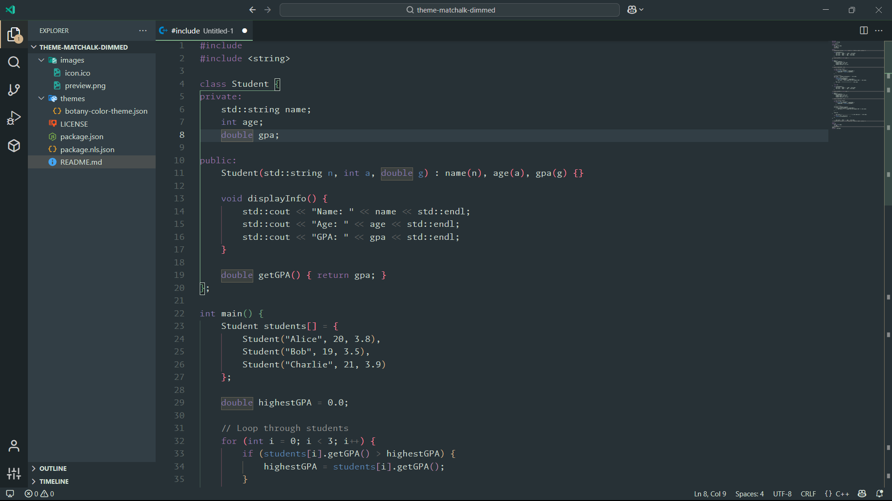

# Botany Theme for VS Code

A soothing dark theme with natural green and earth tones, designed for long coding sessions with reduced eye strain.



## Features

- **Natural Color Palette**: Inspired by botanical elements with sage greens, earth tones, and soft purple accents
- **Enhanced Syntax Highlighting**: Carefully tuned colors for improved code readability
- **Low Contrast**: Designed to reduce eye strain during long coding sessions
- **Bracket Colorization**: Distinct colors for matching brackets and parentheses


## Installation

1. Launch Visual Studio Code
2. Go to Extensions (Ctrl+Shift+X)
3. Search for "Botany Theme"
4. Click Install
5. Go to File > Preferences > Color Theme and select "Botany"

## Recommended Settings

For the best experience, consider using these additional settings:

```json
{
    "editor.fontFamily": "Your favorite monospace font",
    "editor.fontSize": 14,
    "editor.lineHeight": 1.5,
    "editor.bracketPairColorization.enabled": true
}
```

## Feedback & Contributions

If you have any suggestions or issues, please open an issue on the [GitHub repository](https://github.com/prabinpanta0/theme-botany).

## License

[MIT](LICENSE)

---

**Enjoy coding with Botany!** 🌱✨

```
            /)/)
            ( . .)
            ( づ🍃
```
